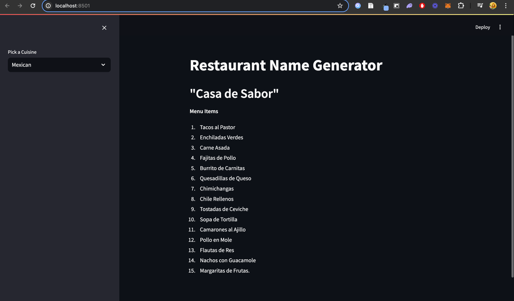

# Restaurant Name Generator

This project is a Streamlit application that generates restaurant names and menu items based on the selected cuisine. The app uses the LangChain and OpenAI APIs for generating the names and menu items.

## Features

- Select from a variety of cuisines (Nepali, Indian, American, French, Mexican)
- Generate a restaurant name and a list of menu items for the selected cuisine

## Installation

1. Clone the repository:
    ```bash
    git clonehttps://github.com/iamshivakhatri/Langchain101.git
    cd restaurant-name-generator
    ```

2. Create and activate a virtual environment:
    ```bash
    python -m venv .venv
    source .venv/bin/activate  # On Windows, use `.venv\Scripts\activate`
    ```

3. Install the required packages:
    ```bash
    pip install -r requirements.txt
    ```

4. Create a `.env` file in the project root directory and add your OpenAI API key:
    ```env
    OPENAI_API_KEY=your-api-key
    ```

## Usage

1. Run the Streamlit application:
    ```bash
    streamlit run main.py
    ```

2. Open your web browser and go to `http://localhost:8501`.

3. Select a cuisine from the sidebar and view the generated restaurant name and menu items.

